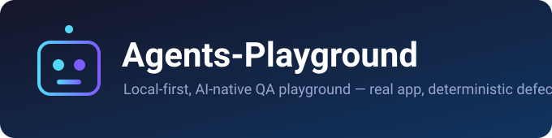
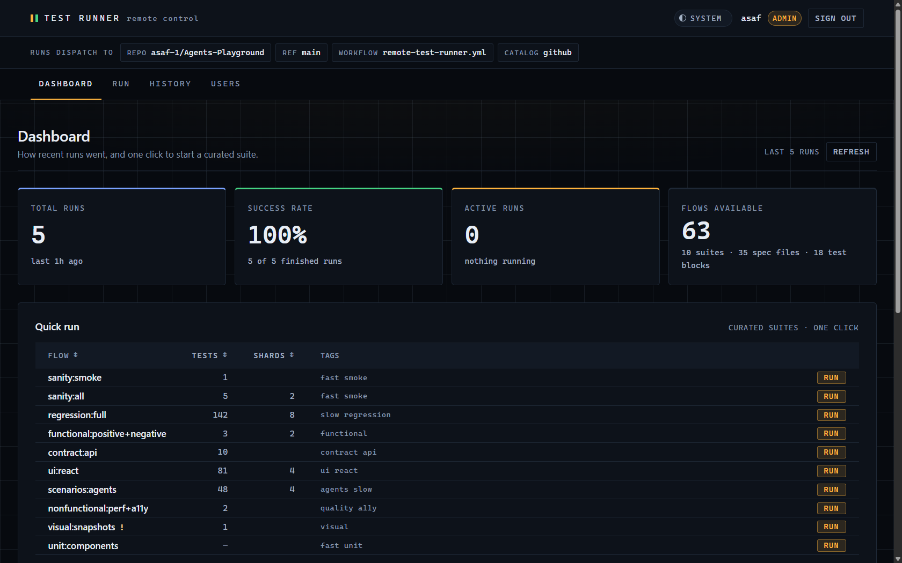

<p align="center">
  
</p>

<p align="center">
  <a href="https://github.com/asaf-1/Agents-Playground/releases/latest"></a>
  <a href="CHANGELOG.md"></a>
  <a href="LICENSE"></a>
  
  
  
  
  
  
  
  
</p>

<p align="center">
  <b>A real web app that breaks on purpose, and the AI agents that fix the tests.</b>
</p>

---

Agents-Playground is a testbed for AI-native QA. It ships a real Node server with
two frontends, an OpenAPI-documented JSON API, and defects that can be armed
deterministically — then points six Playwright agents at it to plan, generate,
diagnose, heal, and report. No mocked UI, no fake failures.

It also ships a **remote test runner**: a separate web app your colleagues sign
into to run the suite on the pipeline, without any GitHub, repository, or
pipeline access of their own.

<p align="center">
  
</p>
<p align="center">
  <sub>The runner, live. 63 flows, one click each, executing on GitHub Actions.</sub>
</p>

## Quick start

```bash
npm install
npx playwright install chromium
npm run build        # builds the React surface at /app
npm start
```

| URL                              | What                     |
| -------------------------------- | ------------------------ |
| `http://127.0.0.1:4173`          | Static pages + JSON API  |
| `http://127.0.0.1:4173/app`      | React SPA                |
| `http://127.0.0.1:4173/api/docs` | Swagger UI (OpenAPI 3.1) |

## Commands

| Command                                      | What it does                                           |
| -------------------------------------------- | ------------------------------------------------------ |
| `npm start`                                  | Serve the app on `127.0.0.1:4173`                      |
| `npm run build`                              | Build the React surface to `public/app`                |
| `npm run dev:web`                            | Vite dev server for the React surface                  |
| `npm test`                                   | Full Playwright suite — 143 tests                      |
| `npm run test:unit`                          | Vitest + Testing Library + MSW                         |
| `npm run test:sanity`                        | Fastest confidence check, one spec                     |
| `npm run test:contract`                      | API replies against `openapi.json`                     |
| `npm run test:visual`                        | Screenshot comparison (opt-in)                         |
| `npm run test:e2e:ui`                        | Playwright UI mode, for debugging a failure            |
| `npm run format:check`                       | Prettier — one of the two checks CI runs               |
| `npm run flows:list`                         | Every flow the remote runner can start, with its id    |
| `npm run flows:check`                        | Fail if the flow catalog is stale — the other CI check |
| `npm run test:flow -- --flow group-sanity`   | Run one catalog flow locally                           |
| `npm run test:remote -- --flow group-sanity` | Start it on the GitHub-hosted runner                   |
| `npm run test:docker:e2e`                    | Full regression inside the container                   |

Agent scenarios, per-category runs, and the rest are in
[`docs/repo-guide.md`](docs/repo-guide.md#test-commands).

## What's in it

|                                |                                                                                                                                                                    |
| ------------------------------ | ------------------------------------------------------------------------------------------------------------------------------------------------------------------ |
| **Two frontends, one server**  | A static surface at `/` (8 vanilla pages) and a React SPA at `/app`, both served by the same zero-framework Node server.                                           |
| **JSON API + contract**        | Health, orders, products, users CRUD, auth/session, RBAC-gated mutations, admin audit log. OpenAPI 3.1 spec with `ajv` tests validating live responses against it. |
| **Defects you arm on purpose** | Per-`runKey` flags spanning DOM/selector, async/state, i18n, accessibility, auth/session and API-contract categories. Off by default.                              |
| **Six QA agents**              | planner, generator, healer, senior-leader, diagnostician, reporter — driven through the `playwright-test` MCP server. They fix the **tests**, never the app.       |
| **Remote test runner**         | Standalone app in `test-runner/`. Sign in, pick a flow, it runs on GitHub Actions.                                                                                 |
| **CI**                         | Branch-first PR flow, pre-push hook, AI review gate, post-merge canary, scheduled regression.                                                                      |

## Remote test runner

The problem it solves: someone needs to run your test suite, and giving them
repository access is the wrong answer.

They get a username and a password on a separate web app. The app holds one
fine-grained GitHub token server-side and dispatches
`.github/workflows/remote-test-runner.yml` on their behalf. They never see the
repository, the pipeline, or the token — and it works with your machine switched
off.

```
Colleague ──▶ test runner app ──▶ GitHub Actions ──▶ 63 flows / 142 tests
  user+pass      one token,          your pipeline
                 server-side
```

- **63 flows**, three tiers: 10 curated suites, 35 spec files, 18 individual test
  blocks. Named in QA vocabulary — `sanity:smoke`, `regression:full`,
  `app:react-orders > tanstack-query`.
- **Self-updating.** `flow-catalog.yml` regenerates the catalog on every push, so
  a new spec appears in the runner without anyone touching the runner.
- **Zero npm dependencies.** CommonJS and `node:` builtins only, no build step.
- **Test-only history.** Runs are titled after the flow and who asked
  (`sanity:smoke · requested by asaf`), not after a commit message.

```bash
npm run flows:list                        # every flow, with its id
npm run test:flow -- --flow group-sanity  # run one locally
npm run test:remote -- --flow group-sanity
```

`sanity:smoke` is the display name; `group-sanity` is the id the CLI and the
workflow take. Ids are stable — names are not.

Full setup — token scope, accounts, deployment: **[`docs/remote-test-runner.md`](docs/remote-test-runner.md)**
and **[`test-runner/README.md`](test-runner/README.md)**.

## AI agents

```
senior leader → pod plan → planner / generator or diagnostician → healer | reporter
```

Drift — a renamed control, slow or flaky data, a 4xx/5xx, a 401/403 — gets
**healed**. By-design defects get **reported**. The distinction is the point.

Definitions live in `.claude/agents/` (Claude) and `.agents/skills/` (Codex).
Details in [`docs/repo-guide.md`](docs/repo-guide.md#ai-agents).

## Documentation

| Document                                                                     | For                                                                 |
| ---------------------------------------------------------------------------- | ------------------------------------------------------------------- |
| [`docs/repo-guide.md`](docs/repo-guide.md)                                   | Full repo reference: every surface, path, test command, and CI rule |
| [`docs/remote-test-runner.md`](docs/remote-test-runner.md)                   | The runner: pipeline, flows, deployment                             |
| [`docs/ai-infrastructure-runbook.md`](docs/ai-infrastructure-runbook.md)     | Cold-start inventory for agents and operators                       |
| [`docs/pre-merge-review-and-canary.md`](docs/pre-merge-review-and-canary.md) | Pre-push, AI review, merge, post-merge canary                       |
| [`docs/react-surface-defects.md`](docs/react-surface-defects.md)             | Every armable defect and what it breaks                             |
| [`docs/flow-naming.md`](docs/flow-naming.md)                                 | How the 63 test flows get their names                               |
| [`CHANGELOG.md`](CHANGELOG.md)                                               | What changed, and what's still missing                              |
| [`md/PORTABLE_AGENT_ADOPTION_GUIDE.md`](md/PORTABLE_AGENT_ADOPTION_GUIDE.md) | Adopting this agent setup in another repository                     |

## Contributing

Work reaches `main` through a pull request from a feature branch. The pre-push
hook runs formatting and the full Playwright suite; `PR Validation / Pre-Merge
Gate` and `AI Review Gate / Current Head Review` must both pass for the exact
head SHA. Details in
[`docs/pre-merge-review-and-canary.md`](docs/pre-merge-review-and-canary.md).

## Changelog

Every release carries its notes:
**[github.com/asaf-1/Agents-Playground/releases](https://github.com/asaf-1/Agents-Playground/releases)**

The full history, including what is still missing, is in
[`CHANGELOG.md`](CHANGELOG.md).

## License

[MIT](LICENSE).
