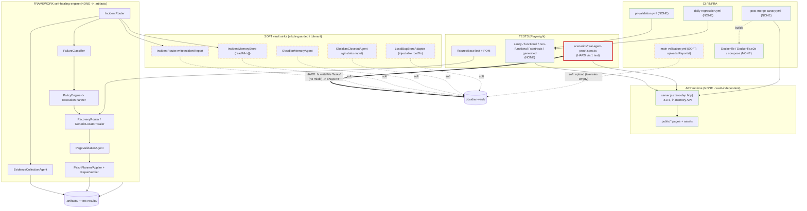

# 07 Architecture Overview

> The canonical big-picture note for **Agents-Playground**. This replaces the stale `md/WORKSPACE_OVERVIEW`-style summaries as the true overview of how the app, the framework, the tests, and CI fit together. For code structure see [[01 Project Map]]; for the test layout see [[02 Test Map]].

## The Four Hats (Plus One)

The repository wears four hats at once, and a fifth fact frames all of them.

| Hat                               | What it is                                                                                                            | Key paths                                                                   | Vault coupling                                            |
| --------------------------------- | --------------------------------------------------------------------------------------------------------------------- | --------------------------------------------------------------------------- | --------------------------------------------------------- |
| **Zero-dep app**                  | A custom Node HTTP server (no framework) on `:4173` with an in-memory JSON API, serving static pages                  | `server.js`, `public/*`                                                     | NONE                                                      |
| **Self-healing framework engine** | Deterministic incident classification, recovery routing, validation, and patch proposal — all output to `.artifacts/` | `framework/agents/**`, `framework/pom/`, `framework/reporting/`             | NONE (engine writers target `.artifacts/`)                |
| **Playwright tests**              | Sanity / functional / non-functional / contract / generated / scenario specs against the running app                  | `tests/e2e/**`, `framework/fixtures/baseTest.ts`                            | NONE, except **one** HARD test (see below)                |
| **CI + Docker**                   | PR validation, post-merge canary, daily regression, runner publish, plus `Dockerfile*` and compose                    | `.github/workflows/*`, `Dockerfile`, `Dockerfile.e2e`, `docker-compose.yml` | NONE (canary), SOFT (one upload in `main-validation.yml`) |

**The fifth fact: the repo root _is_ the Obsidian vault.** Notes live under `obsidian-vault/`, but you open the **repo root** as the vault to catch everything. This is why a few code paths can touch vault files at runtime — they share the filesystem, not a special API bridge (see [[03 Agent and Obsidian Workflow]]). The dependency consequences of that coupling are mapped in [[08 Vault Dependency Map]].

The app, the engine, and almost all tests are **vault-independent**: a clean checkout with only `server.js` and `public/` boots and serves, and the engine only ever writes to `.artifacts/`.

## End-to-End Self-Healing Flow

When a spec hits trouble against the app, the flow is deterministic and auditable — no blind re-greening:

1. **Failing spec** drives the app through a `SelfHealingPage` page object (POM in `framework/pom/`), wired in via `framework/fixtures/baseTest.ts`.
2. **`IncidentRouter`** receives the incident and fans out the chain:
   - **`FailureClassifier`** — buckets the failure into the 14-category taxonomy (UI vs API, locator drift vs by-design defect, including the now-lit `auth-or-session` and `permissions-or-rbac` categories).
   - **`PolicyEngine` -> `ExecutionPlanner`** — decides whether a QA-safe recovery is allowed and plans the steps.
   - **`RecoveryRouter` / `GenericLocatorHealer`** — applies safe mitigations (locator healing, extend-wait, refresh-and-retry).
   - **`PageValidationAgent`** — re-checks the page against its reusable contract.
   - **`PatchPlanner` / `PatchApplier` + `RepairVerifier`** — produce proposal-only patches (this version does **not** auto-edit source during recovery).
3. **`IncidentRouter`** also drives **`EvidenceCollectionAgent`** for screenshots, traces, and narrative enrichment.
4. **Outputs land in `.artifacts/`** (always) and, on the soft path, in `obsidian-vault/Reports/` (run-generated, tolerant — see below).

Drift heals; a genuine by-design product defect is **reported, not papered over**. The full agent catalog (planner, generator, healer, diagnostician, reporter, plus the framework engine agents) lives in [[10 Agent Roster]].

## Architecture + Dependency Diagram

The diagram below colors edges by how tightly they couple to the vault: **HARD (red)** = can break a required gate if `obsidian-vault/` paths are missing; **SOFT (dashed orange)** = mkdir-guarded / tolerant, cannot break a gate; **NONE (green)** = vault-independent (engine targets `.artifacts/`).

The single red edge is the only place the vault can break a gate: `tests/e2e/scenarios/real-agent-proof.spec.ts:174-212` (`"Obsidian memory agent updates a task Result section"`) does `fs.writeFile` into `obsidian-vault/Tasks/real-agent-proof-temp-*.md` **with no `mkdir`** — if `Tasks/` is missing, the write throws `ENOENT` and the spec fails `test:e2e` (pre-push), `pr-validation`, and `main-validation`. Because `obsidian-vault/Tasks/` is git-**tracked** (only `Reports/*` and `.obsidian/` are gitignored), a clean checkout stays green; the recommended hardening is mkdir-before-write or writing to a tmp dir. Every other vault edge is dashed (SOFT) and survives a missing path. The full HARD/SOFT/NONE breakdown is in [[08 Vault Dependency Map]].

## Where Outputs Land

| Sink                                                  | Who writes                                                                                                                                                            | When                         | Git status                   | Failure mode                                                                           |
| ----------------------------------------------------- | --------------------------------------------------------------------------------------------------------------------------------------------------------------------- | ---------------------------- | ---------------------------- | -------------------------------------------------------------------------------------- |
| `.artifacts/` + `test-results/`                       | The framework engine (`EvidenceCollectionAgent`, `PatchPlanner/Applier`, `scenarioArtifacts.ts`) and Playwright                                                       | **Always**, on every run     | gitignored                   | N/A — created on demand                                                                |
| `obsidian-vault/Reports/`                             | SOFT sinks: `IncidentRouter.writeIncidentReport`, `IncidentMemoryStore`, `ObsidianMemoryAgent` healing/workspace logs, `LocalBugStoreAdapter` (`Reports/Bug Reports`) | Run-generated, opportunistic | **gitignored** (`Reports/*`) | Tolerant — mkdir-guarded, `try/catch`; "report write failure should not fail the test" |
| `obsidian-vault/Tasks/`, `AGENT_MEMORY.md`, map notes | Humans / agents during closeout; the one HARD test at runtime                                                                                                         | On documentation / closeout  | git-**tracked**              | The HARD test is the only one that can fail a gate here                                |

Rule of thumb: **engine evidence is `.artifacts/` and is always safe; vault `Reports/` output is a soft bonus that tolerates missing directories.** The canary contract reflects this — it only uploads `.artifacts/` and never depends on the vault.

## Intentional Demo Defects (Protected — Do Not Fix)

These are **deliberate teaching defects**. They are what the diagnose -> report path exists to demonstrate, and per [[06 Agents Playground Guide]] and the project review rules they must **not** be "fixed" unless the user explicitly changes scope.

- **RBAC over-permission** — `server.js:587-616`: with `rbacBug='editor-delete'` armed, an Editor is wrongly allowed to `DELETE /api/users/:id` (the gate is bypassed at line 592-593), so the server returns `200` where it should return `403`.
- **Broken product render state** — `server.js:448-473`: with `state=broken`, the product has `price: "NaN"`, an intentionally omitted subtitle, and `layout.overlap: true`. This is the by-design defect the `PageValidationAgent` contract catches.
- **Shared plaintext password** — the demo uses the shared password `demo1234` across seeded accounts (in-memory, local-only auth).
- **Open test hooks** — `/api/test/*` (flags, `reset-users`, `reset`, `set-session`) are intentionally open so tests can seed deterministic state.

If a review flags any of these, the correct response is to **document and protect**, not to repair.

## Pointers Map

| You want...                                       | Go to                              |
| ------------------------------------------------- | ---------------------------------- |
| Code / product structure & routes                 | [[01 Project Map]]                 |
| Test suite layout, categories, exact commands     | [[02 Test Map]]                    |
| The agent catalog (Playwright + framework engine) | [[10 Agent Roster]]                |
| CI workflows, canary contract, Jenkins scope      | [[09 Infrastructure and CI Map]]   |
| Vault coupling: HARD / SOFT / NONE detail         | [[08 Vault Dependency Map]]        |
| Agent ↔ Obsidian operating model                  | [[03 Agent and Obsidian Workflow]] |
| Operator walkthrough of the demo                  | [[06 Agents Playground Guide]]     |
| Vault entry point                                 | [[00 Home]]                        |

> CI is **GitHub-first**; Jenkins is out of scope for the current pre-merge and canary phase. Current workflow policy is synchronized across [[02 Test Map]], [[04 Daily Regression Automation]], [[05 Enterprise Infrastructure Rules]], and [[09 Infrastructure and CI Map]]. Active task context: [[009 GitHub Pre-Merge Review and Canary]].
