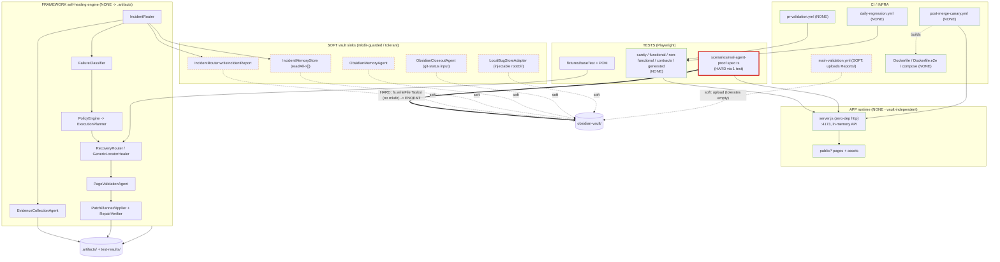

# 08 Vault Dependency Map

> The definitive, file-cited answer to **"what breaks if `obsidian-vault/` disappears?"** Use this before refactoring, moving, or trimming the vault so you do not accidentally redden a gate. Companion to [[07 Architecture Overview]] (the visual model) and [[09 Infrastructure and CI Map]] (the gate definitions).

## 1. TL;DR

The build / test / serve **spine is vault-independent**. You can delete or relocate every note in `obsidian-vault/` and still build the image, serve the app, and pass CI — with **exactly one** exception.

- **HARD = 1.** A single test (`real-agent-proof.spec.ts:174-212`) writes into `obsidian-vault/Tasks/` with no `mkdir`. If `Tasks/` is missing, it throws `ENOENT` and fails three gates.
- **SOFT = ~7 sinks.** Every other vault writer/reader is `mkdir`-guarded, `try/catch`-wrapped, `readAll -> []` tolerant, has an injectable `rootDir`, or is a tolerant artifact upload. **None of them can fail a gate.**
- **NONE = everything else.** `server.js`, all of `public/*`, the entire self-healing framework engine (it writes to `.artifacts/` only), all Docker, all workflows, and all non-vault tests do not touch the vault at all.

Refactor rule of thumb: **the vault is a documentation + memory layer, not a runtime dependency.** Honor the one HARD seam (keep `Tasks/` present, or harden the test) and you can reshape the rest freely. See [[02 Test Map]] for the suite layout and [[10 Agent Roster]] for which agents touch the vault.

## 2. HARD dependency (the only one)

| Field                               | Detail                                                                                                                                                                                                                                                                                                                                                              |
| ----------------------------------- | ------------------------------------------------------------------------------------------------------------------------------------------------------------------------------------------------------------------------------------------------------------------------------------------------------------------------------------------------------------------- |
| Location                            | `tests/e2e/scenarios/real-agent-proof.spec.ts:174-212` — test `"Obsidian memory agent updates a task Result section"`                                                                                                                                                                                                                                               |
| Mechanism                           | At line **184** the test does `fs.writeFile(taskPath, ...)` where `taskPath = obsidian-vault/Tasks/real-agent-proof-temp-<ts>-<rand>.md`. There is **no `fs.mkdir(...,{recursive:true})`** before the write. If `obsidian-vault/Tasks/` does not exist, the write throws `ENOENT`.                                                                                  |
| Why the agent code does not save it | The test seeds a temp note, then calls `ObsidianMemoryAgent.updateTaskResult()`, which at `ObsidianMemoryAgent.ts:108` does `const raw = await fs.readFile(absolutePath, "utf-8")` — **a no-fallback read with no mkdir**. This is the seam the test exercises, so neither the test nor the agent creates `Tasks/`.                                                 |
| Gates it fails                      | (1) **pre-push** via `test:e2e` (`.githooks/pre-push` -> `scripts/pre-push-check.*`); (2) **PR Validation** (`pr-validation.yml`, the scenarios run); (3) **main-validation** (`main-validation.yml`).                                                                                                                                                              |
| Gates it does NOT fail              | The **post-merge canary** (`post-merge-canary.yml`) runs only `test:sanity` + `test:contract`, never the scenarios — so a missing `Tasks/` is invisible to the canary.                                                                                                                                                                                              |
| Why a clean checkout is green       | `obsidian-vault/Tasks/` is **git-tracked** (verified via `git ls-files`; `.gitignore` ignores only `Reports/*` and `.obsidian/`). A fresh `git clone` therefore materializes `Tasks/` with its existing task notes, the directory exists, and the write succeeds. The seam only bites if someone deletes `Tasks/` locally or moves the vault without preserving it. |
| Recommended hardening               | Either `await fs.mkdir(path.dirname(taskPath), { recursive: true })` immediately before the `fs.writeFile`, **or** redirect the temp note to an OS tmp dir (e.g. `os.tmpdir()`) so the test is fully vault-independent. Either change makes the suite tolerant of a missing/relocated `Tasks/` and removes the last HARD edge.                                      |

## 3. SOFT sinks (guarded — cannot break a gate)

Each of these writes to or reads from the vault, but every one degrades gracefully. **What breaks if the vault path is missing = nothing** (no thrown error reaches a gate).

| Sink                                   | Vault path                                      | Guard                                                                                                                                                                          | What breaks                                                                                     |
| -------------------------------------- | ----------------------------------------------- | ------------------------------------------------------------------------------------------------------------------------------------------------------------------------------ | ----------------------------------------------------------------------------------------------- |
| `IncidentRouter.writeIncidentReport`   | `obsidian-vault/Reports/Incidents/`             | `mkdir` + `try/catch` (comment: "report write failure should not fail the test")                                                                                               | Nothing                                                                                         |
| `IncidentMemoryStore`                  | `obsidian-vault/Reports/...` (incident memory)  | `mkdir` on write; `readAll()` catches errors and returns `[]`                                                                                                                  | Nothing — memory just reads empty                                                               |
| `ObsidianMemoryAgent` (logs)           | `Reports/Healing/`, `Reports/Workspace/`        | `writeHealingRunLog` / `writeWorkspaceStateLog` both `fs.mkdir(dir,{recursive:true})` before write (`ObsidianMemoryAgent.ts:95`, `:131`)                                       | Nothing                                                                                         |
| `ObsidianMemoryAgent.updateTaskResult` | `obsidian-vault/Tasks/<note>.md`                | **No-fallback `fs.readFile` (`ObsidianMemoryAgent.ts:108`), no mkdir** — this is the seam the HARD test rides on, but the agent itself is only called against an existing note | Nothing on its own (it is the HARD _test_ that creates the edge, not this method in normal use) |
| `ObsidianCloseoutAgent`                | references vault note **paths as strings only** | Input is `git status --short`; it classifies changed files and never requires reading vault contents to run                                                                    | Nothing                                                                                         |
| `LocalBugStoreAdapter`                 | `obsidian-vault/Reports/Bug Reports/`           | `mkdir` + **injectable `rootDir`** (point it elsewhere for tests)                                                                                                              | Nothing                                                                                         |
| `main-validation.yml` upload-artifact  | `obsidian-vault/Reports/`                       | Reports/ is **gitignored**; `actions/upload-artifact` tolerates a missing/empty path (warns, does not fail)                                                                    | Nothing                                                                                         |

Local-only helpers that **never run in CI** and so cannot gate anything: `scripts/obsidian-closeout.js`, `scripts/github/fetch-claude-review.js`, `scripts/bug-reporting/run-local-bug-report.js`.

### JSON data policy (the vault holds no tracked JSON data)

Every JSON the SOFT sinks write — `Reports/Incidents/incident-memory.json` (learned recovery strategies), `Reports/Incidents/<date>-<scenario>.json` (incident reports), `Reports/Bug Reports/index.json` + `BUG-*.json` — lives under the **gitignored** `obsidian-vault/Reports/*`. So it is **per-machine, ephemeral, and regenerated each run** (fresh in CI), never versioned. The durable, shared second brain is the tracked **markdown** notes; cross-session learning is distilled into [[AGENT_MEMORY]] and `Snapshots/`, not persisted as raw JSON in git. The vault's only tracked JSON is the root `.obsidian/` config — and `workspace.json` (personal pane layout) is gitignored so it does not churn the history. Session-bearing artifacts (`.artifacts/auth/admin.json`) stay gitignored by design.

## 4. NONE — the vault-independent spine

These touch the vault **not at all**. Delete `obsidian-vault/` entirely and they behave identically.

- **App runtime:** `server.js` (zero-dependency HTTP server, in-memory API, `:4173`), all of `public/*` (pages + assets), and the `Dockerfile` image built from them.
- **Self-healing framework engine:** `FailureClassifier`, `PolicyEngine`, `ExecutionPlanner`, `AgentRegistry`, `RecoveryRouter`, `GenericLocatorHealer`, `SelectorHealer`, `NetworkRecoveryAgent`, `pageProfiles`, `PageValidationAgent` + contracts, `PatchProposal` / `PatchPlanner` / `PatchApplier`, `RepairVerifier`, `EvidenceCollectionAgent`, `NarrativeEnricher`, `ApiDiagnosisAgent`, all POM / fixtures / data, and the LLM agents. **Engine writers target `.artifacts/` only**, never the vault.
- **Tests:** every spec under `sanity/`, `functional/`, `non-functional/`, `contracts/`, and `generated/`. Only `scenarios/real-agent-proof.spec.ts` has a vault edge (see §2).
- **Workflows:** `pr-validation.yml`, `post-merge-canary.yml`, `daily-regression.yml`, `publish-playwright-runner.yml` (`main-validation.yml` is SOFT only because of its tolerant Reports/ upload — see §3).
- **Container + hooks:** `Dockerfile`, `Dockerfile.e2e`, `docker-compose.yml`, `scripts/docker/`, `.githooks/pre-push`, `scripts/pre-push-check.*`.

## 5. `.gitignore` policy — why the HARD test is green by default

The split below is the reason a clean checkout never hits the §2 `ENOENT`: the directory the HARD test writes into ships with the repo.

| Vault path                                    | Status                                   | Why it matters                                                                                 |
| --------------------------------------------- | ---------------------------------------- | ---------------------------------------------------------------------------------------------- |
| `obsidian-vault/Reports/*`                    | **IGNORED** (except `Reports/README.md`) | Generated incident/healing/workspace/bug output is local-only; SOFT sinks `mkdir` it on demand |
| `obsidian-vault/.obsidian/`                   | **IGNORED**                              | App config / workspace UI state, not project truth                                             |
| `obsidian-vault/Tasks/`                       | **TRACKED**                              | A fresh clone materializes it -> the §2 HARD write into `Tasks/` succeeds -> gates stay green  |
| `obsidian-vault/Inbox/`                       | **TRACKED**                              | Agent handoff notes versioned with the project                                                 |
| `obsidian-vault/Snapshots/`                   | **TRACKED**                              | Cold-resume session snapshots                                                                  |
| `obsidian-vault/Templates/`                   | **TRACKED**                              | Reusable task / report formats                                                                 |
| Numbered notes (`00`–`10`, `AGENT_MEMORY.md`) | **TRACKED**                              | Canonical second-brain notes                                                                   |

**Key consequence:** the single HARD edge is _latent_ in normal use precisely because `Tasks/` is tracked. The risk surfaces only when someone (a) deletes `Tasks/` locally, (b) relocates the vault without carrying `Tasks/`, or (c) stops tracking it. Until the §2 hardening lands, **keep `obsidian-vault/Tasks/` tracked and present.**

## 6. Architecture + dependency diagram

---

## See also

- [[07 Architecture Overview]] — the system architecture this dependency model overlays.
- [[09 Infrastructure and CI Map]] — authoritative gate definitions (and the Jenkins reconciliation that supersedes stale merge-gate language elsewhere).
- [[10 Agent Roster]] — which agents are the SOFT vault sinks listed in §3.
- [[02 Test Map]] — suite layout and the exact commands behind each gate.
- [[00 Home]] — vault entry point.
